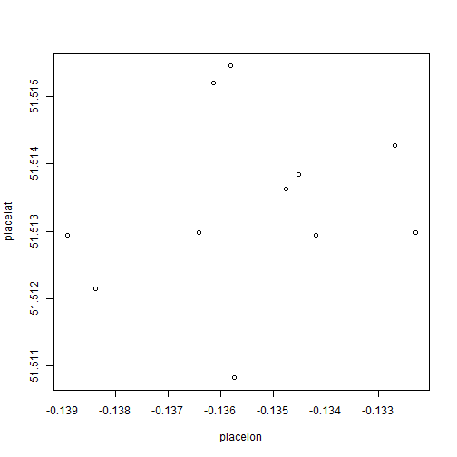

<style>
.title-slide {
  background-color: #ff6600; /* #EDE0CF; ; #CA9F9D*/
}

.title-slide hgroup > h1{
 font-family: 'Calibri', 'Helvetica', sanserif; 
}

</style>

## Introduction


1. The objective is to group coffee shops in Soho, London so that users can make the most informed choices of where to go based on proximity and popularity metrics.

2. The data can also be used to derive strategies for market positioning in a very competitive market.

3. The clustering tool allows k-means clustering analysis to derive target sub-groups using pairwise mixes of parameters. 

4. The parameters are derived from distance measures, ratings and the number of reviews.

https://wilkinsondi.shinyapps.io/ShinyApp


--- .class #id 

## Data


- Data is from Google and Yelp for 12 coffee shops (16Nov15).
- Popularity = rating score / sqrt(number of reviews)
- Distance = coffee shop (lat,lon) minus Oxford Circus (lat,lon).

```
##        names popularity distfactor reviews rankpop rankdist
## 1  FlatWhite  45.782093  0.0085317     131       2      7.0
## 2  TapCoffee  21.166010  0.0065623      28       9      4.5
## 3         FW  24.647515  0.0075335      30       8      6.0
## 4    Yumchaa  43.266615  0.0059792     117       3      2.0
## 5   Foxcroft  35.099858  0.0098014      77       4      9.0
## 6     Princi  58.651513  0.0085590     215       1      8.0
## 7     Sacred  30.724583  0.0050714      59       5      1.0
## 8  SohoGrind  16.000000  0.0064150      16      10      3.0
## 9    SohoJoe  24.657656  0.0099630      38       7     10.0
## 10   Algeria  28.814059  0.0116491      41       6     12.0
## 11    Tapped  11.313708  0.0065623       8      11      4.5
## 12     Tonic   8.944272  0.0103778       5      12     11.0
```

---.class #id

## Locations

```r
plot(placelon, placelat) # Co-ordinates of coffee shops
```

 

---bg:#ff6600

## Outcomes
- A k-means clustering analysis is used to analyse target sub-groups.
- The distance rank and popularity rank with k-means of 3 yields a clear clustering for coffee shop segmentation for the discerning coffee drinker or coffee shop strategist. 
    - This is a crude prototype model that can be evolved in many ways.
    - Include more coffee shops over a wider area
    - More sophisticated distance parameters
    - More features to differentiate offerings
    - More sophisticated model
    - Better integration of analytics and mapping tools


